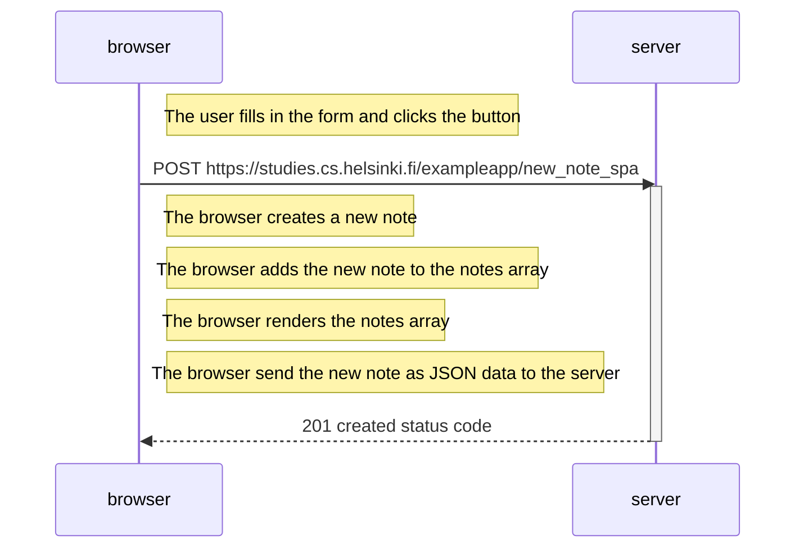

```mermaid
sequenceDiagram
    participant browser
    participant server

    Note right of browser: The user fills in the form and clicks the button

    browser->>server: POST https://studies.cs.helsinki.fi/exampleapp/new_note_spa
    activate server

    Note right of browser: The browser creates a new note
    Note right of browser: The browser adds the new note to the notes array
    Note right of browser: The browser renders the notes array
    Note right of browser: The browser send the new note as JSON data to the server


    server-->>browser: 201 created status code 
    deactivate server
```